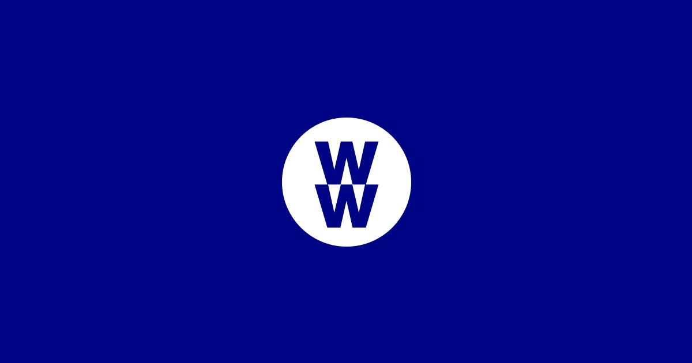
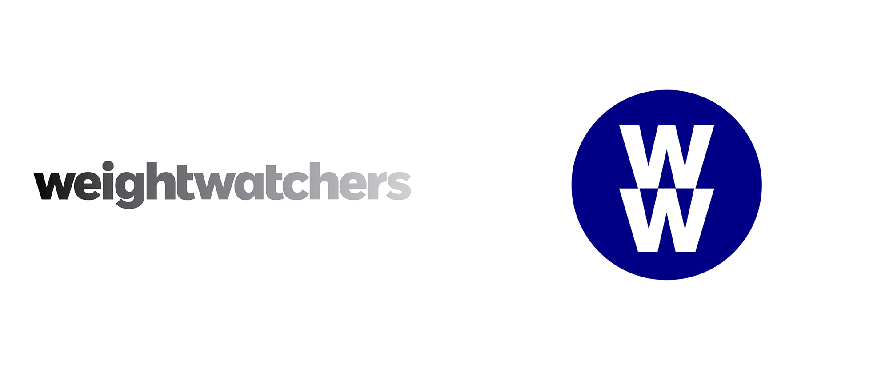

<!--StartFragment-->

Ask anyone, your aunt, your uncle, your friend or distant cousin...it seems that everyone knows someone who has been to *WeightWatchers*. But what is it that makes them such a popular platform and their services so immediately recognisable? Well, typography has a lot to do with it.

<!--EndFragment-->

The `header_feature_image` is optional and you should enter the path to it in the metadata above.

> Here follows some more placeholder text. You can see the `markdown` when viewing this post in Atom. This is a *blockquote*.

<!--StartFragment-->

Without even using words, WeightWatchers is immediately identifiable through their striking and simple logo: blue background with a white circle and two W’s in the middle. It sounds simple enough, but how has it become so ingrained into our minds that this is a weight loss company? 

It starts with colour: It is a deep blue, hex code #000585, a commanding and eye catching colour that stands in sharp contrast against the pure white, which draws the consumer’s attention to the centre, the main identifier of the product. The use of a dark blue could be used as a method of inclusivity, a way to allude to the idea of men also being included in weight loss products, instead of only targeting women, which, typically, is what the diet industry does, or it could just simply be a marketing strategy, using bold colours in order to be seen from far away.

However, you cannot convert people by just use of colour, your text has to stand out too; which is why they changed their logo in 2018 from Font Typeface (left) to National 2 (right). While their previous logo had softer, lower case text, their new logo stands out vividly with the two capital W’s. This also reflects the notoriety of the brand, since they no longer need to put their whole company name, just their initials, meaning their reputation speaks for itself.

<!--EndFragment-->

## Here is a an image

<!--StartFragment-->

Their new logo is much more bold in comparison to the somewhat clinical feel of their previous one. Their use of colour, for instance, is much more appealing to the eye, as black and white rarely captures the attention of consumers as much as a striking colour and stand out lettering.

The new logo makes for an easy way of identifying their products on the shelves or their classes on a building. In this way, it makes the consumers feel as though they are a part of something. Perhaps it also removes the sense of it being a diet plan, and instead simply a brand of food, or a club, removing the potential embarrassment of saying that you are trying to lose weight, instead saying: “I am a part of WW”. All these factors contribute to the hypnotic effect of Weightwatchers, and the sense of community consumers feel when they buy into their brand, and diet culture, altogether.

<!--EndFragment-->