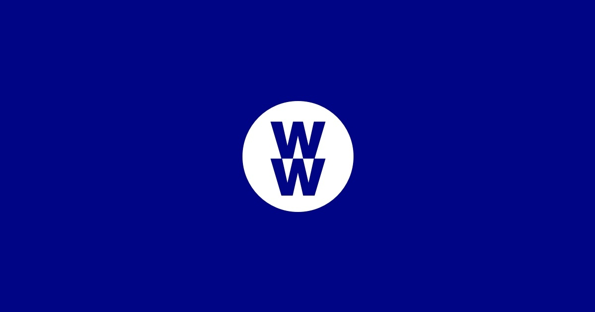
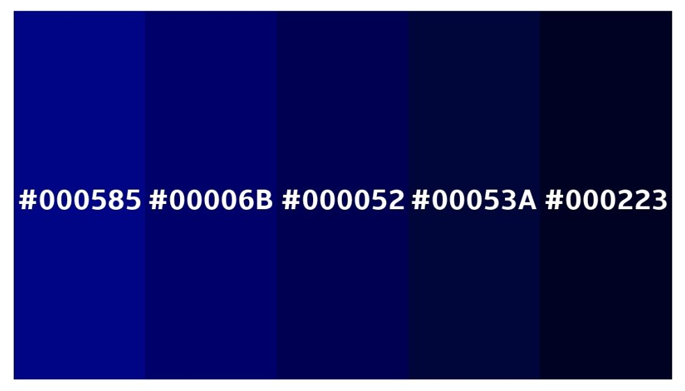

Ask anyone, your aunt, your uncle, your friend or distant cousin...it seems that everyone knows someone who has been to *WeightWatchers*. But what is it that makes them such a popular platform and their services so immediately recognisable? Well, typography has a lot to do with it.

Without even using words, *WeightWatchers* is immediately identifiable through their striking logo: a blue background with a white circle and two W’s in the middle. It sounds simple enough, but how has it become so ingrained into our minds that this is a weight loss company?

It starts with colour: It is a deep blue, hex code #000585, a commanding and eye catching colour that stands in sharp contrast against the pure white, which draws the consumer’s attention to the centre, the main identifier of the product. According to *Bourn Creative,* the use of the colour blue is often linked with a representation of trust, sincerity, confidence and intelligence, which is exactly the message that *WeightWatchers* is trying to portray*.* Compared to darked gradients of blue, #00585 feels more positive; as darker blues such as #00053A convey a more ominous tone, usually linked to feelings of melancholy, presumably to opposite of *WeightWatchers* intention.

The use of a dark blue could have also been used as a method of highlighting inclusivity, a way to allude to the idea of men also being included in weight loss products, instead of typically targetting women, but this blue also seems gender neutral, a signal to the consumers that all are welcome in the products and their services, a key driver for the success of their brand.

However, you cannot convert people by just use of colour, your text has to stand out too; which is why they changed their logo in 2018 from Font Typeface (left) to National 2 (right). While their previous logo had softer, lower case text, their new logo stands out vividly with the two capital W’s. This also reflects the notoriety of the brand, since they no longer need to put their whole company name, just their initials, meaning their reputation speaks for itself.

Their new logo is much more bold in comparison to the somewhat clinical feel of their previous one, reinforced by their use of colour, as the new blue is much more appealing to the eye compared to black and white, which rarely captures the attention of consumers as much as a striking colour and block lettering.

In their previous logo, they refrained from using any capital letters, meaning the X height was the same throughout. This gave it a softer and less imposing feel, however, without contrast, the logo isn’t as eye-catching and memorable as their most recent one, in fact, their most recent one is composed entirely of capital letters, making it stand out more efficiently and created a more identifiable brand.

The new logo makes for an easy way of identifying their products on the shelves or their classes on a building. By not including the full name of WeightWatchers and instead rebranding themselves as WW, perhaps it removes the sense of it being a diet plan and instead simply a brand of food, or a club, foregoing the potential embarrassment of saying that you are trying to lose weight, instead saying “I am a part of WW”.In this way,it makes the consumers feel as though they are a part of something.  All these factors contribute to the hypnotic effect of Weightwatchers, and the sense of community consumers feel when they buy into their brand, and diet culture, altogether.