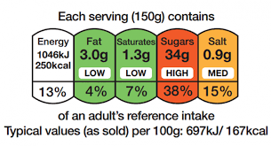
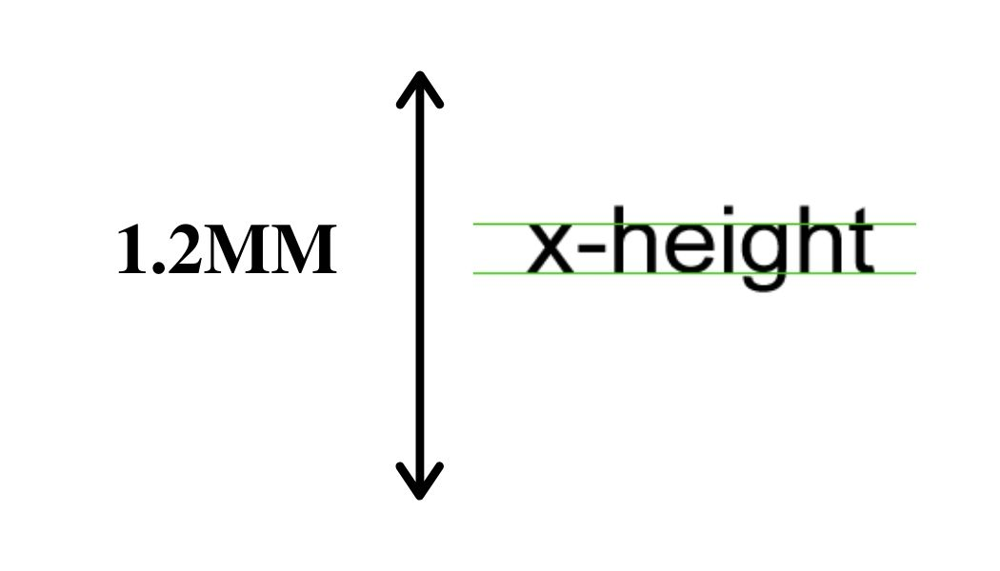
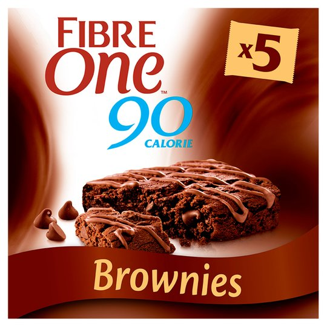

Whether you realise it or not, the diet industry directly impacts our day-to-day lives, so much so, that is becoming increasingly unlikely that anyone could go a day without eating food that has not been given a nutritional value. But how does typography play a role in defining what is ‘good’ food and what is ‘bad’? To understand that, we must analyse the way in which brands present themselves and their packaging.

From the late 1960s, pre-packaged foods started to become more widely manufactured and available. Therefore, since people were no longer home cooking as often, they then became curious as to the content of the food they were eating. The food industry soon became required by law to state the calorie, fat, saturated fat, carbohydrates and sodium content of their products on their packaging.

In the United Kingdom, we follow the Food Information Regulations made by the European Union’s regulation 1169 (2011) which acts as a guide to font size and labelling.

A food production company in the UK can use most legible fonts but have to abide by the x-height being at least 1.2mm. The most commonly used font for nutritional labels in the UK is **Arial**, an easy to read and professional typeface, often used for resumes.

The legislation on the font size is deliberately 1.2mm so companies cannot hide their nutritional information with minuscule text, however, some might argue that this is already too small to catch the attention of the consumer. This, of course, means people are more likely to buy their products if they cannot read the contents of it, a ploy used by companies in order to convince the consumer to purchase the product.

Depending on the company, alongside the nutritional information on the back, some choose to present certain contents in a different way, according to how much they want to highlight the content of their products. Low-calorie foods will sometimes plaster their nutritional content on the front in large letters, proud of the little to no energy it provides. This is most commonly used by so-called ‘diet’ or ‘light’ versions of products, such as *Alpen*’s 70 calorie cereal bars, or *Fiber One*’s 90 calorie brownies.

In *Fiber One*’s brownies, for example, the calorie content is written boldly on the front, in the same font size as the name of the product itself, insinuating that their nutritional content is just as integral to their ethos as a company; it acts as the unique selling point (USP) of their entire brand. ‘One’ and ‘90’ are both written in **Charm Italic** by Typomancer, condensed to make it lighter and rounder. The wispy tails of the letters suggest an element of indulgence, something the production team wants to highlight, whilst contrasting that with the fact it is only 90 calories.

Therefore, although there is strict legislation on how and what you must print on your product, companies still manipulate the consumer into buying into them and the diet industry by using this same information. For high calorie or fat products, this is often hidden on the back under nutritional information, while low calorie or fat products often use this as their main selling point, and people, quite literally, eat that up.