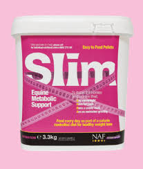

When I asked my followers on Instagram, “What colour do you associate with the diet industry?”, unsurprisingly, the overwhelming majority said Pink. But why is that such an obvious answer? Why do diet products so often feature this colour? In this article, I will be exploring the use of pink in diet products, as well as the use of typography, to seek to answer the question of what result diet companies are hoping to elicit.

All branding begins with connotations, ie. what will the consumer think when they see this product? Colour is a big part of those connotations, it is one of the first ways that products seduce us into buying them. Gender, itself, is colour coded: boys are currently allocated blue, therefore, many products intended for men, such as deodorant or razors, are blue, while girls are allocated pink, so they get pink shower gel, pink clothes and, of course, pink diet products. Brands use this deeply entrenched colour system within their products to appeal to specific genders and even age ranges. 

The shades of pink sometimes vary, but diet companies often use baby pink or hex code #F5C3C2. A decision not only made to attract women but young girls, too, which has been heavily criticised by dieticians and health care professionals.

However, it is not simply because of the use of pink that convinces people to buy these products, its also the typographic format of their advertising and products, also aimed towards the younger generation of women and girls.

Here, this product uses imagery and typography that reinforces the values of diet culture, as well as attracting the young female demographic. Written in a variation of typeface Primitive Tuscan with the measuring tape compressing the lettering, it reinforces that not only will this product help you become thin, but also that this is something to strive for.

For the younger generation, particularly teenage girls, body image is a common anxiety and 'quick-fix' products like these use connotations of typography, imagery and colour to encourage purchase to repair this. As seen above, diet products often using bold lettering for keywords such as 'Diet', 'Thin' or 'Slim', while the actual contents remain in a small font size. 

All of this, of course, is intentionally made to attract those who have struggled with their weight on either end of the spectrum. Diet products use our inherited ideals of thinness to make a profit, using typography to programme within us connotations of what will achieve the desired result.