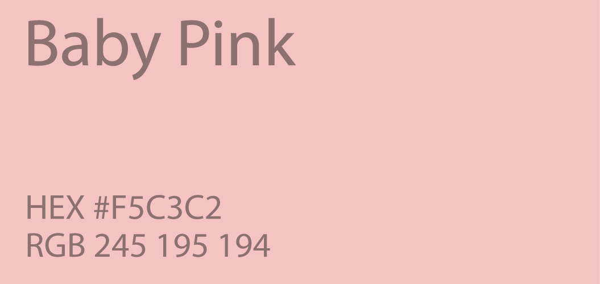

When I asked my followers on Instagram, “What colour do you associate with the diet industry?”, unsurprisingly, the overwhelming majority said Pink. But why is that such an obvious answer? Why do diet products so often feature this colour? In this article, I will be exploring the use of pink in diet products, to seek to answer the question of what reaction diet companies are hoping to elicit through their targeted shades of pink.

All branding begins with connotations, ie. what will the consumer think when they see this product? Colour is a big part of those connotations, it is one of the first ways that products seduce us into buying them. Gender, itself, is colour coded: boys are currently allocated blue, therefore, many products intended for men, such as deodorant or razors, are blue, while girls are allocated pink, so they get pink shower gel, pink clothes and, of course, pink diet products. Brands use this deeply entrenched colour system within their products to appeal to specific genders and even age ranges. 

The shades of pink sometimes vary, but most often diet companies use baby pink or hex code #F5C3C2. A decision not only made to attract women but young girls, too.