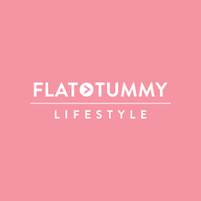
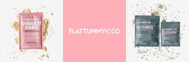

*Flat Tummy Co.*, a company infamous for Kim Kardashian's promotion of their hunger-restricting lollipops, is perhaps one of the clearest examples of what I spoke about in my last post: using their typography to target young women.

Their logo, for instance, is composed of bubblegum pink as their primary colour, used for its connotations with playfulness, and pure white, often used to bring a sense of simplicity and purity, stemming from the biblical symbolism of virtue. The two colour’s contrast draws the reader's eyes to the centre of the logo, where their brand name is centrally aligned.

However, it is not down to pink alone that they appeal to younger women, but also their use of fonts and typefaces, chosen to be bold and eye-catching, perhaps intentionally built so customers feel compelled to post their purchases on social media. They use font *Boldface* and typeface *Brandon Grotesque Office*, which uses the same cap-height throughout the logo. Although it is all in capital letters, there is not the impression that the words are shouting at you, due to its thin lines and their icon, which breaks down the intensity.

*Flat Tummy Co.* are experts in targeting their products to a particular demographic. Their aesthetically pleasing logo and products are what draws people into their values, as well as making it more appealing to influencers who wish to advertise their products on their platforms. It is no wonder then, that they have such popularity with younger women.

