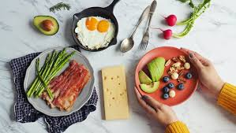
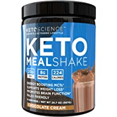

The Ketogenic Diet, most commonly referred to as ‘Keto’, was originally a diet plan made to treat epilepsy in children, but, of course, it was later adopted by the diet industry as a method of weight-loss. Unlike many other diet products, a lot of the branding and typography used in Keto products are targeted towards men.

The use of colour in Keto products is an immediate contrast to the often pink-orientated diet products I have dissected before. This is because the demographic for the Keto diet is typically men (again, we go back to the old ‘blue is for boys, pink is for girls’). They tend to use darker shades of blue, favoured by products typically seen as ‘manly’, such as razors because Keto is favoured by men trying to lose body-weight and gain muscle.

This product uses both imagery and typography to appeal to its demographic. The picture of the so-called ‘MealShake’ looks indulgent and full of chocolate, enticing those following the diet who have had to surrender these types of foods. The background is a blue and black image resembling a ‘K’, making the consumer able to immediately identify it as a Keto product.

The product makes no attempt to hide its contents, in fact, it highlights them in the middle of the label, as nutritional information is something that people on diets immediately look for. They have used thicker lettering for “KETO MEAL” in comparison to ‘SHAKE’ trying to convince the consumer that this is a meal and not simply a protein shake. 

Keto products are specifically designed to create a convincing lifestyle to seduce onlookers into following the highly restrictive, and sometimes even dangerous, diet.