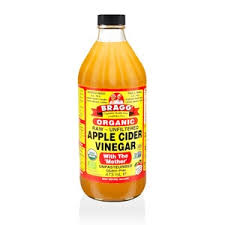
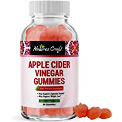

If you have any social media account, particularly Instagram or Facebook, you may have seen people advocating for the consumption of apple cider vinegar to aid weight loss. Yes, a simple salad dressing is one of the diet industry’s new crazes, favoured and endorsed by celebrities such as Victoria Beckham and Katy Perry. But how did an ingredient turn into a health fad? You guessed it...typography played a significant role.

This apple cider vinegar, sold by Holland & Barrett, does not seem like a world renowned weight loss product, yet it is sold in the thousands for exactly that purpose. Bragg, the creator of the product, does not use any enticing imagery, colour or typography to appeal to the diet industry. 

The use of yellow and red clashes against the colour of the actual liquid, making it unappealing to look at. There seems to be no sense of composition, with the information all bunched together, making the customer unsure what to read first. The different font sizes and typefaces make the product confusing and unattractive.

Which raises the question: why do so many people swear by products such as these?

In recent years, as more and more people have been influenced by the diet industry, companies have adapted their packaging into more appealing formats. While very little of us would wish to take several shots of pure vinegar a day, companies have now rebranded their products into more digestible merchandise.

This product by Natures Craft has rebranded the concept of Apple Cider Vinegar completely. Not only have they made the product into more appealing forms of consumption, but the typography is far more enticing. 

With both the title and the product itself the same colour of pink, they complement each other in a way that is attractive to the consumer. The brand logo is black, a sharp contrast to the softer colours of the rest of the packaging.

The title is the largest text on the product, used as a tactic to grab the attention of the buyer straight away, while the actual details and contents are almost unreadable, perhaps disguising the true contents of the product. 

The title of their product is in Astrid Grotesk Extra, all written in bold and condensed to highlight both the reputation of apple cider vinegar and the fact it is now in a ‘gummy’ form. Which the creators know will evoke intrigue in their potential customers.

Altogether it forms an attractive product that buyers can post on their social media, coaxing more people to buy into a product that has little effect on general wellbeing and body weight.